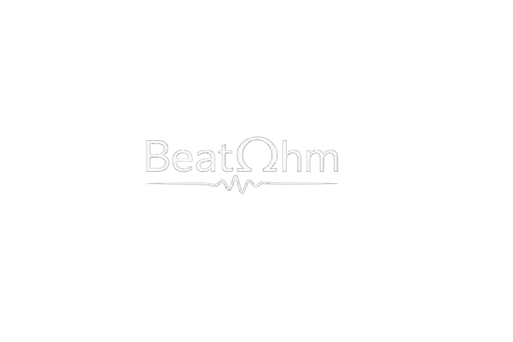
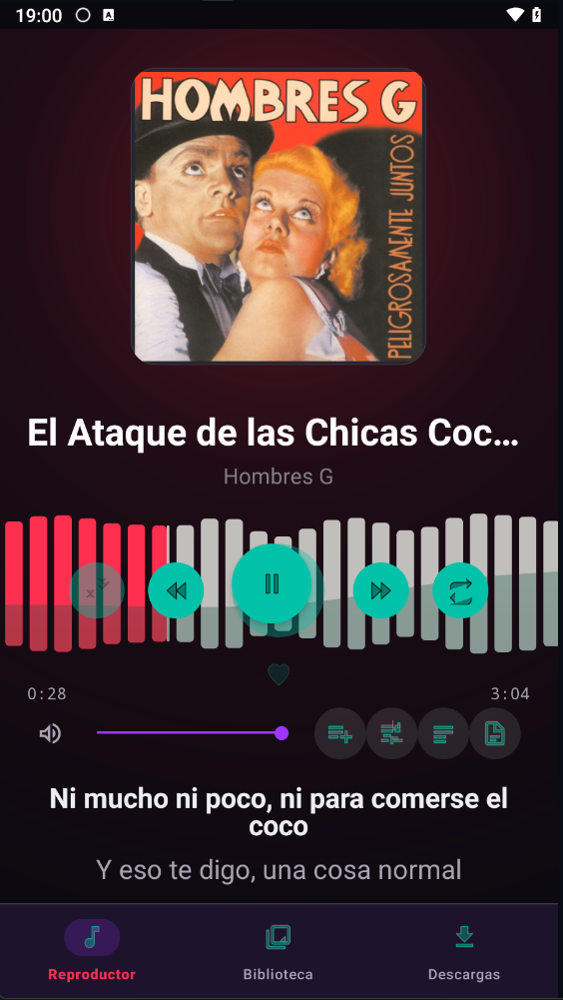
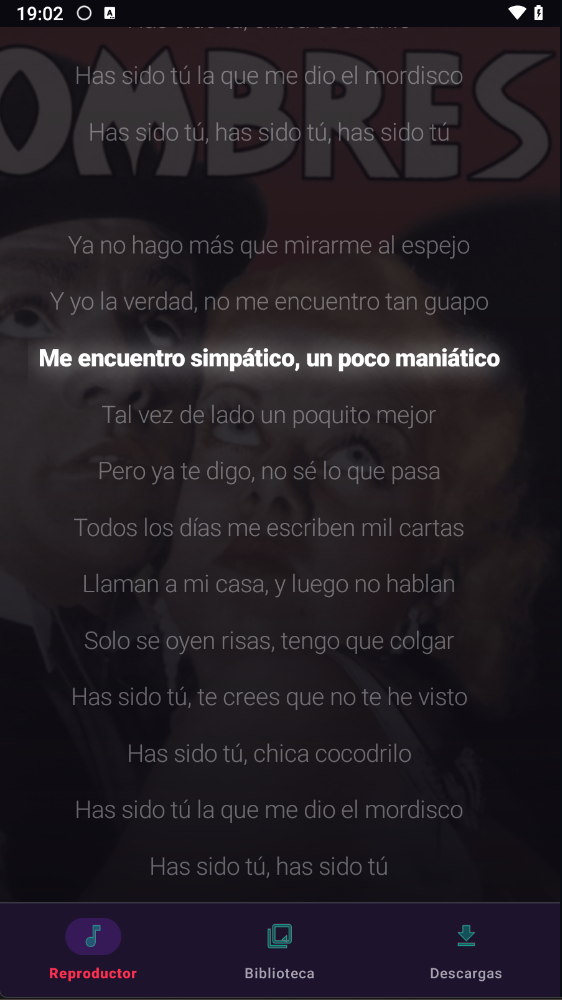
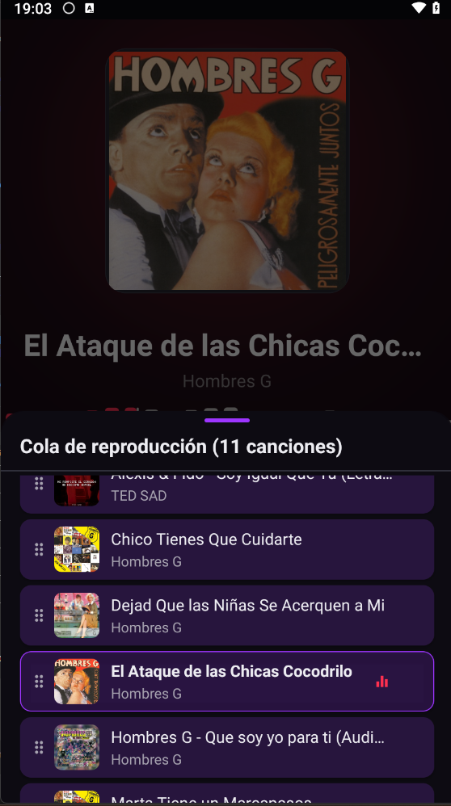
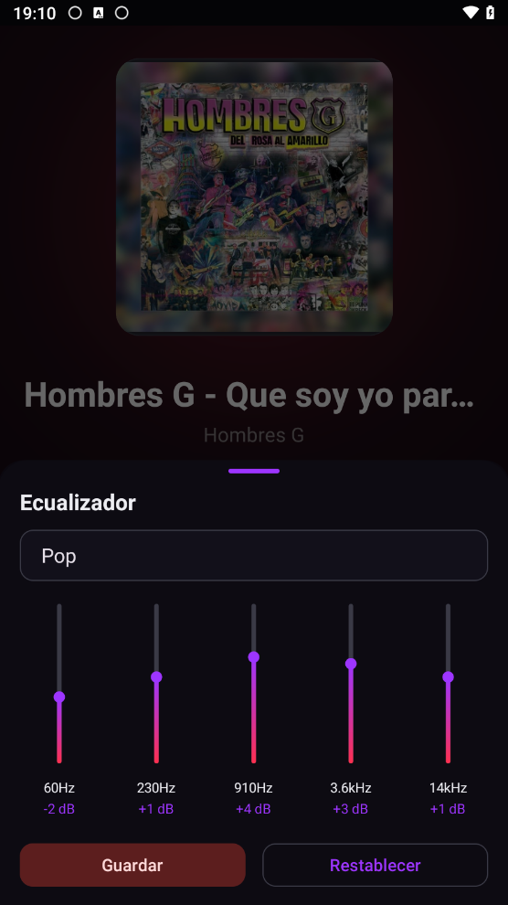
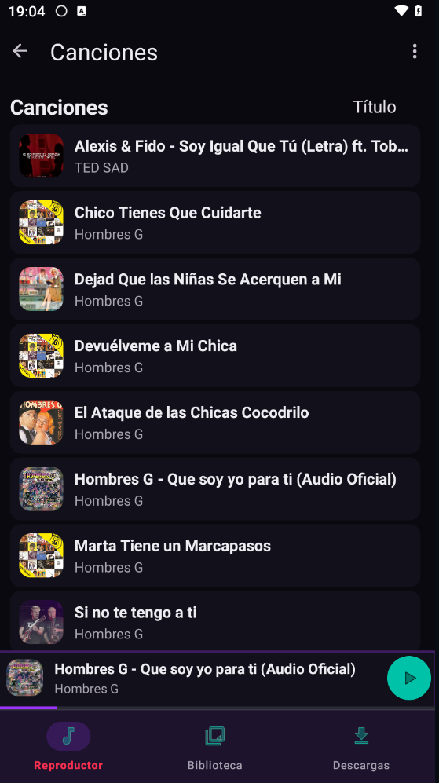
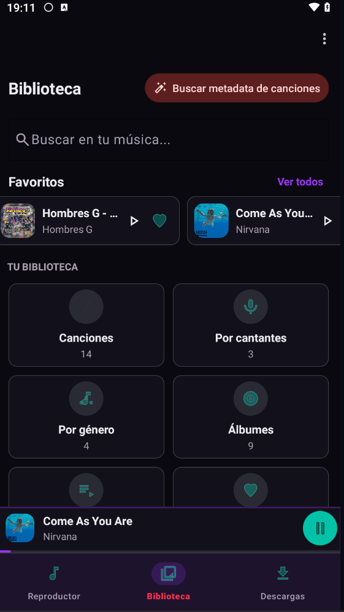
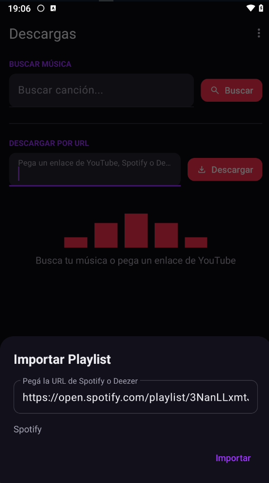
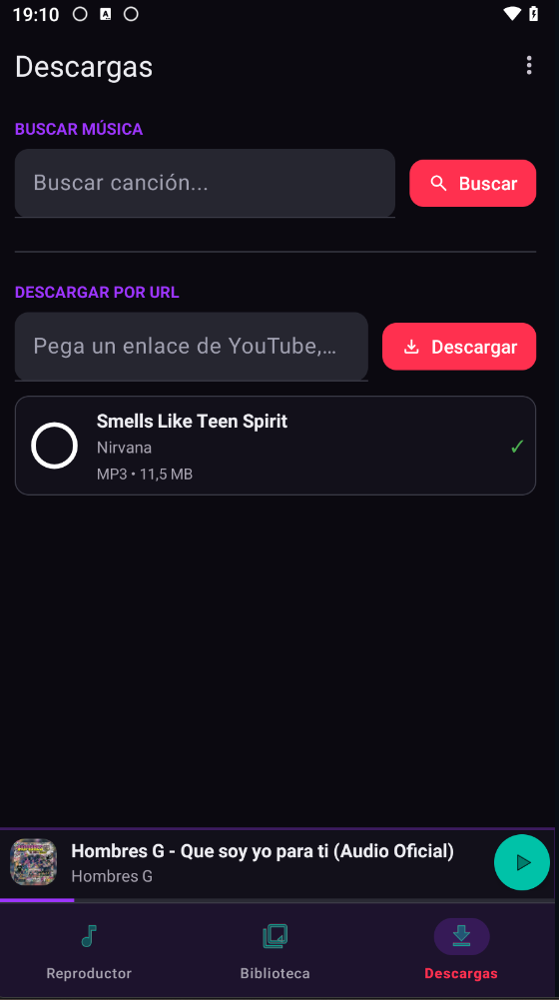
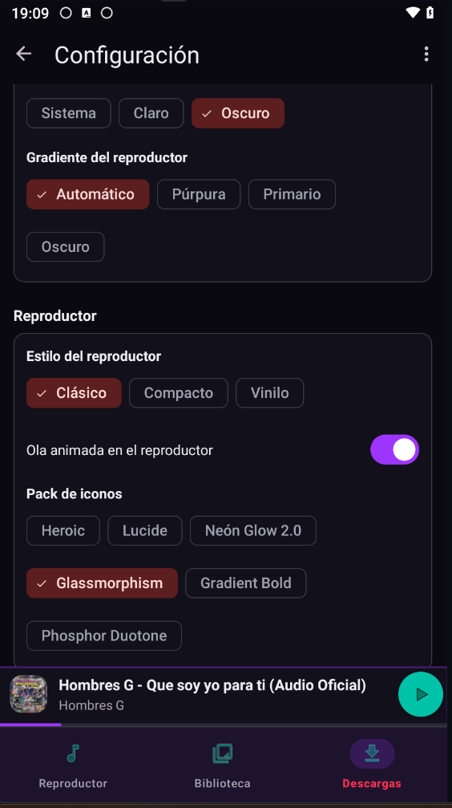

<div align="center">

# 🎵 BeatOhm



### Tu estudio de sonido personal. Audio moldea, BeatOhm lo hace visible.

**Descargá, procesá y escuchá tu música favorita — con descargas en MP3, soporte multi-formato (MP3, M4A, FLAC, OGG, Opus, WAV), metadata impecable, letras multi-fuente y un visualizador que moldea el audio en tiempo real.**

[]()
[]()
[]()
[]()
[](LICENSE)
[]()

---

<br/>

</div>

## Capturas

**Reproductor** — waveform en tiempo real, letras sincronizadas y cola de reproducción.

| | |
|---|---|
|  |  |
|  |  |

**Biblioteca** — explorá canciones, álbumes, artistas, favoritos y playlists.

| | |
|---|---|
|  |  |

**Descargas** — importá playlists completas de Spotify o Deezer con un link.

| | |
|---|---|
|  |  |

**Configuración** — packs de iconos, idioma y preferencias.

| | |
|---|---|
|  | |

---

## Características principales

### ⬇️ Descarga

- **Importación masiva de playlists** — pegá una URL de Spotify o Deezer y descargá toda la playlist automáticamente.
  - Paginación completa para playlists grandes (100+ tracks)
  - Rate limiting inteligente (máx 2 descargas simultáneas)
  - Reintentos con exponential backoff
  - Progress bar "Importando X de N"
  - Cancelación limpia
  - Reanudación automática si la app se cierra
- **YouTube / YouTube Music** — pegá cualquier link (playlist o canción individual) y descargá.
- **Metadata automática** — InnerTube extrae título, artista y miniatura. Luego se enriquece con iTunes y MusicBrainz (álbum, género, año, número de track, carátula en alta resolución).
- **Letras multi-fuente** — cascada de LRCLIB → Genius → lyrics.ovh con variantes de búsqueda. Soporte de letras sincronizadas (LRC).
- **Tags ID3 completos** — cada archivo se graba con título, artista, álbum, género, año, número de track, carátula y letras.
- **Proxy confiable** — fallback a loader.to cuando la descarga directa no está disponible.
- **Limpieza automática de metadata** — detecta y limpia nombres de canales de YouTube, playlists, y texto extra del título. Reintentos con solo título si la búsqueda completa falla.

### 🎧 Reproductor Premium

- **Waveform stroboscópico** — extracción ultra-rápida con `seekTo()` + 3 sub-muestras por barra (~1.5s por canción vs ~25s antes). RMS + Peak mix, contraste exponencial, suavizado entre barras vecinas.
- **Visualizador de onda de audio real** — extrae amplitud real del archivo de audio via MediaExtractor + MediaCodec. 1 barra por 1.2 segundos de audio. Datos cacheados en Room para carga instantánea.
- **Scroll continuo tipo Poweramp** — cursor fijo al 30%, la onda se desplaza suavemente. Fling con inercia (OverScroller, fricción 0.008) para deslizamiento fluido.
- **Gesto invertido** — deslizar a la izquierda adelanta, a la derecha retrocede (empujar línea de tiempo).
- **Dynamic Gradient** — colores extraídos del Palette de la carátula (6 swatches), gradientes animados.
- **Album Art Glow** — efecto de brillo dual-layer en la carátula.
- **Letras glassmorphism** — panel translúcido con tap-to-seek y swipe-to-close. Letras sincronizadas con resaltado de línea actual. Scroll manual en texto plano.
- **Cola glassmorphism** — bottom sheet con DiffUtil, animaciones escalonadas, stroke en canción actual.
- **Mini Player** — barra de progreso gradient integrada en el mini player.
- **Media3 ExoPlayer** — motor de reproducción nativo con controles en notificación.
- **Shuffle & Repeat** — aleatorio y repetición (una canción / toda la lista).
- **Favoritos** — marcá cualquier canción como favorita con un toque.

### 🌊 BeatVisualizer — DSP en tiempo real

- **5 bandas de frecuencia** — Bass (<150Hz), Mids (300Hz–3.5kHz), Treble (>4kHz) con filtros IIR de primer orden.
- **Filtros adaptativos** — alfas calculados dinámicamente desde `sampleRate` del dispositivo (no hardcoded).
- **Peak detection** — captura el pico máximo de cada banda por buffer, no el promedio. La ola reacciona al instante.
- **Mezcla mono L+R** — `(L+R)/2` para análisis de frecuencia preciso.
- **Mapeo espacial** — Treble → izquierda, Mids → centro, Bass → derecha. La ola se mueve asimétricamente.
- **Smoothing asimétrico** — ataque rápido (0.95), release diferenciado por banda. Bombo "respira", voz fluye.
- **Waveform mask** — la ola solo se visible dentro de las barras del waveform.
- **Física de spring** — 5 anclas con damped spring + Catmull-Rom Bézier para curvas suaves.

### 📚 Biblioteca

- **Canciones** — lista completa con ordenamiento por título, artista, álbum o duración.
- **Álbumes / Artistas / Géneros / Años** — explorá por diferentes criterios.
- **Favoritos / Más escuchadas** — ranking por contador de reproducciones.
- **Playlists** — creá, editá y eliminá playlists personalizadas.
- **Multi-selección** — seleccioná varias canciones para agregar a playlist, regenerar metadata o borrar.
- **Borrar canciones** — eliminá canciones de la biblioteca y del disco con confirmación.

### 🌍 Multi-idioma

- **3 idiomas** — Español (default), English, Português.
- **Selector de idioma** — cambio instantáneo desde Settings sin reiniciar la app.
- **200+ strings localizados** — toda la UI traducida (botones, diálogos, tutoriales, estados).

### 📖 Tutoriales

- **Tooltips por sección** — tutorial interactivo para Reproductor (10 pasos), Biblioteca (4 pasos), Descargas (3 pasos).
- **Tooltips de letras** — aparecen solo al abrir el panel de letras (tap para saltar, swipe down para cerrar).
- **Animación glow** — el botón/elemento que se explica brilla en loop mientras el tooltip está visible.
- **Reiniciar tutorial** — botón en Settings para volver a ver los tutoriales.

### 📁 Carpetas personalizadas

- **Escaneo de carpetas** — agregá directorios externos con SAF.
- **Enriquecimiento en background** — metadata automática sin duplicar datos.
- **Renombrado automático** — archivos renombrados al formato "Artista - Título".

### 🔧 Regeneración de metadata

- **Regen por canción** — regenerá metadata, waveform, artwork, letras o color dominante por canción.
- **Regen en lote** — seleccioná varias canciones y regenerá todo de una.
- **Reintentar fallidas** — botón para reintentar canciones pendientes o fallidas.
- **Foreground Service** — regeneración con notificación, pause/resume/cancel.

---

## Stack tecnológico

| Componente | Tecnología | Versión | Para qué |
|------------|-----------|---------|----------|
| **Lenguaje** | Kotlin | — | 100% Kotlin |
| **UI** | XML + ViewBinding | — | Layouts declarativos |
| **Reproductor** | Media3 ExoPlayer | 1.4.1 | Motor de audio, MediaSession |
| **Base de datos** | Room | 2.6.1 | Persistencia (songs, playlists, themes, regen, imports, candidates, playback events) — DB v11 |
| **Networking** | OkHttp | 4.12.0 | Descargas, APIs |
| **JSON** | Gson | 2.10.1 | Parseo de respuestas API |
| **Tags** | JAudioTagger + vorbis-java | 3.0.1 + 0.8 | Escritura de tags ID3 y Vorbis Comments |
| **Imágenes** | Coil | 2.6.0 | Carga de carátulas |
| **Waveform** | MediaCodec + seekTo | — | Stroboscopic extraction (~1.5s/song) |
| **DSP** | IIR Filters | — | 3-band frequency separation (bass/mid/treble) |
| **Design** | Material Components | 1.11.0 | Material 3, bottom sheets |
| **Palette** | Palette | 1.0.0 | Colores dinámicos desde carátula |

---

## Testing

### Unit tests

Tests puros de lógica de negocio (sin Android framework):

```bash
.\gradlew.bat :app:testDebugUnitTest --no-daemon --console=plain
```

Cobertura:
- `MetadataCleaningTest` — limpieza de títulos, artistas, normalización
- `FolderPatternParserTest` — sanitización de nombres de archivo
- `TagWriteCounterLogicTest` — lógica de contador de escrituras
- `MetadataFetcherScoringTest` — scoring, dedup, umbrales

### Integration tests (Room)

Tests de instrumentación (requieren emulador/dispositivo):

```bash
.\gradlew.bat :app:connectedDebugAndroidTest --no-daemon --console=plain
```

Cobertura:
- `MetadataCandidateRoomTest` — insert, status transitions, delete operations

### Manual testing

Ver `docs/MANUAL_TEST_MATRIX.md` para la matriz completa de testing manual por dispositivo y feature.

### Diagnostics

Ver `docs/DIAGNOSTICS.md` para guía de diagnóstico de metadata, ads y DB.

---

## Instalación

### Desde código fuente

```bash
git clone https://github.com/Jalargo07/Music-downloader-for-Android.git
cd Music-downloader-for-Android
./gradlew assembleDebug
adb install app/build/outputs/apk/debug/app-debug.apk
```

### Desde releases

Descargá el APK desde [GitHub Releases](https://github.com/Jalargo07/Music-downloader-for-Android/releases).

### Requisitos

- Android Studio Hedgehog (2023.1) o superior
- JDK 17
- Dispositivo o emulador con Android 7.0 (API 24) o superior

---

## Estructura del proyecto

```
app/src/main/java/com/beatohm/
├── BeatOhmApplication.kt           # Application init (TagWriteCounter, InMobi)
├── MainActivity.kt                  # NavHost + BottomNav + mini player
├── MusicPlaybackService.kt          # Media3 playback + notification
├── PlaylistDetailActivity.kt        # DEPRECATED — use PlaylistDetailFragment
├── MetadataRegenService.kt          # Foreground service: metadata regen
├── ImportPlaylistService.kt         # Foreground service: playlist import
├── MusicWidgetProvider.kt           # Home screen widget
├── DeviceUtils.kt                   # DRY: getOptimalThreadCount(), MUSIC_FOLDER_NAME
│
├── ads/
│   ├── TagWriteCounter.kt           # Free write limit (100 tags)
│   └── InMobiManager.kt             # InMobi Ads SDK wrapper
│
├── audio/
│   ├── WaveformExtractor.kt         # Stroboscopic: seekTo + RMS/Peak
│   ├── LevelCaptureProcessor.kt     # DSP: 3-band IIR filter → 5 anchors
│   └── AudioVisualizerManager.kt    # Consume LevelCaptureProcessor → StateFlow
│
├── data/
│   ├── AppDatabase.kt               # Room DB v11 (10 entities)
│   ├── LocalSong.kt                 # Song entity
│   ├── SongDao.kt                   # DAO (40+ queries)
│   ├── IMusicRepository.kt          # Interface (Dependency Inversion)
│   ├── MusicRepository.kt           # Enrichment + merge + lyrics
│   ├── IWaveformRepository.kt       # Interface
│   ├── WaveformRepository.kt        # Waveform extraction
│   ├── IRegenRepository.kt          # Interface
│   ├── RegenRepository.kt           # Regen status tracking
│   ├── ILibraryRepository.kt        # Interface
│   ├── LibraryRepository.kt         # Scan, folders, covers
│   ├── PlaylistRepository.kt        # Playlists
│   ├── AudioTagWriter.kt            # Tags ID3 + Vorbis Comments
│   ├── OpusTagWriter.kt             # Opus-specific tag writer
│   ├── TagWriteLimitReachedException.kt
│   ├── PlaybackEvent.kt             # Playback scoring entity
│   ├── PlaybackEventDao.kt
│   ├── RegenStatus.kt               # Regen tracking entity
│   ├── RegenStatusDao.kt
│   ├── MetadataCandidateEntity.kt   # Ambiguous metadata candidates
│   ├── MetadataCandidateDao.kt
│   ├── MetadataCandidateRepository.kt
│   ├── Playlist.kt / PlaylistSong.kt / PlaylistWithSongs.kt
│   ├── UserTheme.kt / ThemeDao.kt / ThemeExporter.kt / PresetThemes.kt
│   ├── TagWriteCoordinator.kt       # Single entry point for all tag writes
│   └── EqualizerRepository.kt       # EQ presets persistence
│
├── importer/
│   ├── UrlDetector.kt               # URL type auto-detection
│   ├── ImportedTrack.kt             # Data model for imported tracks
│   ├── IPlaylistImporter.kt         # Interface (Dependency Inversion)
│   ├── SpotifyImporter.kt           # Spotify via embed endpoint
│   ├── DeezerImporter.kt            # Deezer free API
│   ├── YouTubeImporter.kt           # YouTube via Innertube
│   ├── PlaylistImportManager.kt     # Core orchestrator
│   ├── ImportSession.kt / ImportTrackStatus.kt  # Room entities
│   ├── ImportSessionDao.kt / ImportTrackStatusDao.kt
│   └── ImportPlaylistBottomSheet.kt  # UI for import progress
│
├── ui/
│   ├── PlayerFragment.kt            # Reproductor premium
│   ├── PlayerAnimationHelper.kt     # SRP: cover animations
│   ├── PlayerLyricsHelper.kt        # SRP: lyrics panel
│   ├── WaveformSeekBar.kt           # Waveform real con scroll, fling
│   ├── WaterVisualizerDrawable.kt   # Water surface with spring physics
│   ├── DynamicGradientDrawable.kt   # Gradient animado desde Palette
│   ├── GlowDrawable.kt              # Album art glow
│   ├── SyncedLyricsView.kt          # Letras sincronizadas
│   ├── QueueBottomSheetDialogFragment.kt
│   ├── LibraryFragment.kt
│   ├── LibraryViewModel.kt
│   ├── SongListFragment.kt
│   ├── FavoritesFragment.kt
│   ├── MostPlayedFragment.kt
│   ├── CategoryListFragment.kt
│   ├── FoldersFragment.kt
│   ├── PlaylistsFragment.kt
│   ├── PlaylistDetailFragment.kt
│   ├── DownloadsFragment.kt
│   ├── EqualizerBottomSheet.kt
│   ├── VerticalSeekBar.kt
│   ├── TutorialManager.kt
│   ├── ThemeManager.kt
│   ├── ArtworkLoader.kt
│   ├── SongSelectorAdapter.kt
│   ├── MainViewModel.kt
│   ├── IconPackManager.kt
│   ├── IconPackDrawableFactory.kt
│   └── player/
│       └── PlayerLayoutManager.kt   # Estilos de layout (vinyl, etc.)
│
├── metadata/
│   ├── MetadataFetcher.kt           # iTunes + MusicBrainz
│   ├── LyricsFetcher.kt             # LRCLIB → Genius → lyrics.ovh
│   ├── MetadataResult.kt            # Fetch result types
│   └── MetadataCleaning.kt          # Name normalization
│
├── downloader/
│   ├── AudioDownloader.kt           # Descarga + conversión + tags
│   └── ProxyDownloader.kt           # Proxy loader.to
│
├── extractor/
│   └── YouTubeExtractor.kt          # InnerTube iOS client
│
├── model/
│   ├── Song.kt
│   ├── SearchResult.kt
│   └── DownloadState.kt
│
└── util/
    └── FolderPatternParser.kt
```

---

## Changelog

### v2.10-stable

**6 Icon Packs — identidad visual propia**

- **Heroic** — pack bold relleno (antes "Filled") con identidad visual propia
- **Lucide** — 27 iconos inspirados en lucide.dev, drawables XML
- **Neon** — glow neón con paths SVG escalados y validados (36+ flags de arco corregidos)
- **Glass** — estilo cristal con paths SVG escalados y validados
- **Gradient** — degradados con paths SVG escalados y validados
- **Phosphor** — duotone real desde SVGs oficiales de phosphoricons.com (27 iconKeys, paths escalados; genres → guitarra)
- Tint dinámico del tema en todos los packs (sin naranja estático en play/prev/next/shuffle/repeat)

**Reproductor Premium**

- Botón play rediseñado: glow de acento (80dp) con contraste WCAG 4.5:1 (`adaptiveGlyphColor`)
- Tint adaptativo en los 5 botones de control según el color del tema
- Botón favorito: corazón del pack relleno (mismo que la categoría Favoritos de la biblioteca), estado favorito diferenciado por brillo (alpha) + toast "Añadida/Eliminada de favoritos"
- Mini player con tint adaptativo en play/pause

**Iconografía**

- `IconPackDrawableFactory` — drawables programáticos para packs color-aware (Neon, Glass, Gradient, Phosphor) con caché por pack/icono/color
- `IconPackManager` unificado: 27 iconKeys canónicos, fallbacks consistentes
- Pack legacy removido (72 drawables `ic_bd_*`/`ic_bn_*`/`ic_mn_*`/`ic_nn_*` eliminados)

**Calidad**

- Warning cleanup completo (lint): 0 warnings en build
- `validate_paths.py` — script que valida los 4 packs SVG (pasa OK)
- Métodos huérfanos eliminados (`attach()` en AudioVisualizerManager)
- `getPlayerIconResIds` reemplazado por `getAppIconResIds` (3 call sites)

---

### v2.9-nightly.260812

**Playlist Import — Pipeline Real + Fixes**

**Pipeline de descarga conectado:**
- ProxyLoader.to → OkHttp download a `/Music/BeatOhm/Unknown/`
- Metadata: iTunes + MusicBrainz (con fallback por título solo)
- Lyrics: LRCLIB → Genius → lyrics.ovh (con metadata CORREGIDA de iTunes)
- Tags ID3v2.3 escritos a mano byte-a-byte (sin jaudiotagger)
- Archivo movido y renombrado a `/Music/BeatOhm/Artista - Cancion.mp3`
- Song guardado en Room DB con lyrics para el player

**Fixes:**
- Deadlock corregido: `parentJob` ya no se pasa al manager
- Cross-filesystem move: `copyTo()` en vez de `renameTo()` (cache → /storage/)
- ID3 corrupto de loader.to: `stripId3Tags()` elimina ID3v2/ID3v1 antes de escribir
- Lyrics ahora se buscan DESPUÉS de metadata corregida (no con datos raw de Spotify/Deezer)
- Imported tracks aparecen en la lista de Downloads de la UI

**UI — URL Auto-Detect:**
- Un solo campo de URL detecta: YouTube canción, YouTube playlist, Spotify playlist, Deezer playlist
- Botón "Import Playlist" eliminado (ya no hace falta)
- Hint unificado: "Paste YouTube, Spotify or Deezer link…"

**Carpeta unificada:**
- `DeviceUtils.MUSIC_FOLDER_NAME = "BeatOhm"` — descargas normales e imports van a la misma carpeta

---

### v2.9-nightly.260811

**BeatOhm — Renaming + Architecture Overhaul**

**Nuevo nombre: BeatOhm**
- La app ahora se llama BeatOhm — ritmo + frecuencia, estudio de sonido personal.

**Clean Architecture**
- 5 interfaces: IMusicRepository, IWaveformRepository, IRegenRepository, ILibraryRepository
- 5 repositorios dedicados: MusicRepository (~200 líneas), WaveformRepository, RegenRepository, LibraryRepository, PlaylistRepository
- Dependency Inversion: toda la UI depende de interfaces, no de implementaciones concretas
- Ningún Fragment accede a AppDatabase directamente

**SRP (Single Responsibility)**
- MusicRepository: de 637 → ~200 líneas (solo enrichment)
- PlayerFragment: de 1302 → ~960 líneas (extrajo PlayerAnimationHelper + PlayerLyricsHelper)

**Waveform Stroboscópico**
- Extracción con `seekTo()` en vez de decodificar el archivo completo
- 3 sub-muestras por barra distribuidas en el rango temporal
- RMS + Peak mix: `(0.6 × RMS) + (0.4 × Peak)`
- Contraste exponencial: `pow(normalized, 1.5)`
- Suavizado 20/60/20 entre barras vecinas
- Velocidad: ~1.5s por canción (antes ~25s)

**BeatVisualizer — DSP en tiempo real**
- 3-band IIR filter (bass <150Hz, mids 300Hz–3.5kHz, treble >4kHz)
- Alfas calculados dinámicamente desde sampleRate
- Peak detection en vez de Sum
- Mapeo espacial: treble→izq, mids→centro, bass→der
- Smoothing asimétrico por ancla

**Fixes**
- Retry button ahora cuenta pending + failed (antes solo failed)
- Strings i18n: "Reset" y "Cancelar" movidos a strings.xml
- Naming warnings eliminados (oldId, notification unused)

---

### v2.9-stable

**Audio DSP**
- 3-band frequency separation (bass/mid/treble) con suavizado independiente por banda
- Sidechain ducking: el bass baja mid/treble automáticamente para un low-end más limpio
- Filtro de bass estricto (α=0.02, threshold 0.18) — solo sub-100Hz
- Decay ×1.20 (treble 0.45→0.54, bass 0.55→0.66) — la ola cae más rápido

**Visualizer**
- Waveform mask: barras ocultas bajo la carátula del cover
- Integración con 3-band EQ para respuesta visual por frecuencia

**Cola de reproducción**
- Lazy column con prefetch (1 canción antes del viewport)
- Animaciones escalonadas solo para items visibles
- Transiciones compartidas album art → mini player

---

### v2.8-stable

**Ecualizador**
- Ecualizador de 5 bandas (60 / 230 / 910 / 3600 / 14000 Hz) procesado en tiempo real con filtros biquad
- Presets (Flat, Bass Boost, Voz, Clásico, Pop, Rock) con persistencia entre sesiones
- Bottom sheet moderno con sliders verticales y guardado automático

**Reproductor premium**
- Ola con momentum al pausar: la ola sigue viajando y se hunde suavemente (amplitud lineal, decaimiento más lento)
- Geometría tipo agua: crestas más bajas y valle descomprimido (se ve agua, no una montaña)
- Glow de carátula/vinilo a pantalla completa, fundido al color de fondo del tema (claro/oscuro) sin corte brusco
- Mini lyrics agrandadas 1.5x con caja más amplia

**Fixes**
- Fix: el halo del cover ya no queda encerrado en el contenedor (transición suave a pantalla completa)

---

### v2.7-nightly.260809

**Waveform Visualizer — Ola centrada con energía**
- Ola única centrada que crece/disminuye según la energía del audio
- Interpolación suave (lerp) entre barras para transiciones fluidas sin saltos
- Actualización a 40ms (25fps) para movimiento natural
- Colores del gradiente reactivos a la energía del waveform

**Waveform refinado**
- 1 barra por 0.5 segundos (era 1.2s), máximo 500 barras
- Coloreado parcial de barras con fracción interpolada
- Energía interpolada entre barra actual y siguiente

**Player mejorado**
- Mini lyrics preview con posición corregida
- Scroll a línea actual al abrir panel de letras
- Modo claro para gradiente, waveform y texto
- Títulos adaptativos según gradiente del tema

**Iconos**
- Pack Heroic (antes Filled) con identidad visual propia
- Solo 3 packs: Material, DarkNova, Heroic
- Todos los iconos usan tint dinámico del tema

**Fixes**
- Fix: metadata cleaning para nombres de playlist y canales de YouTube
- Fix: 4 intentos de búsqueda de metadata (iTunes + MusicBrainz)
- Fix: waveform extractor con 1 barra/0.5s para mayor resolución
- Fix: modo claro funcional en gradiente y waveform
- Fix: mini lyrics constraint y posición del preview

---

### v2.7-nightly.260808

**Multi-idioma**
- Selector de idioma en Settings (Español / English / Português) con cambio instantáneo
- 200+ strings localizados en 3 idiomas (values/, values-en/, values-es/, values-pt/)
- Bottom navigation labels traducidos

**Tutoriales interactivos**
- Tooltips por sección: Reproductor (10 pasos), Biblioteca (4), Descargas (3)
- Tooltips de letras solo al abrir el panel (tap para saltar, swipe down para cerrar)
- Animación glow en loop en el target del tooltip
- "Reiniciar tutorial" en Settings

**Borrar canciones**
- Multi-selección en lista de canciones → botón "Borrar" en rojo
- Confirmación antes de borrar archivo de disco + DB

**Metadata mejorada**
- Limpieza de nombres de playlist ("Letras", "Lyrics", etc.)
- Limpieza de sufijos de canal ("En Español", "VEVO", "Official", etc.)
- 4 intentos de búsqueda: iTunes(artist+title) → MusicBrainz → iTunes(title-only) → MusicBrainz(title-only)
- Limpieza aplicada incluso cuando no se encuentra metadata

**Waveform**
- 1 barra por 1.2 segundos (era 3 segundos)
- Placeholder visual cuando no hay canción reproduciendo
- Long-press para resetear waveform por canción (dev tool)

**Letras**
- Scroll manual funciona en texto plano (sin letras sincronizadas)
- Panel de letras no se mueve solo cuando no hay letras sincronizadas

**Fixes**
- Crash BadTokenException en tooltips (PopupWindow delayed)
- Tooltips: folders brilla solo el item de carpetas (no todo el grid)
- Tooltips: prev/next animan ambos botones independientemente
- Inglés: capitalización estandarizada (Title Case)

---

## Licencia

```
MIT License
Copyright (c) 2026 BeatOhm
```

---

<div align="center">

**Hecho con Kotlin y mucho café ☕**

</div>
